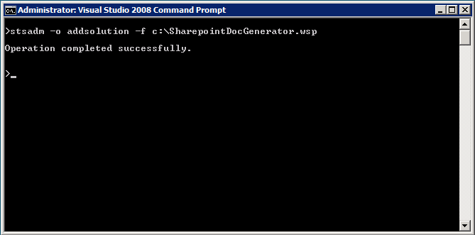
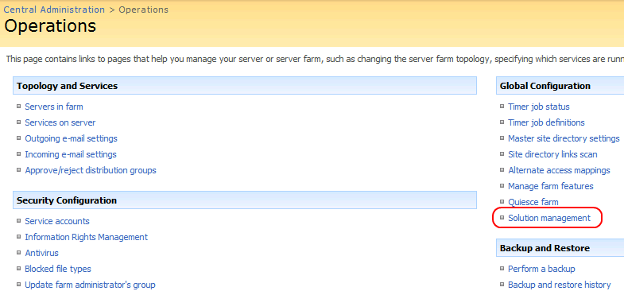
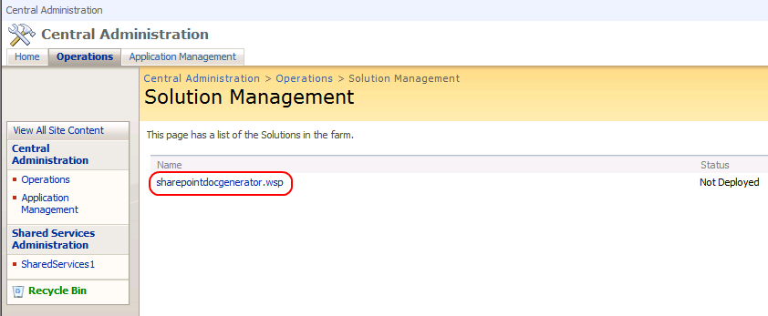
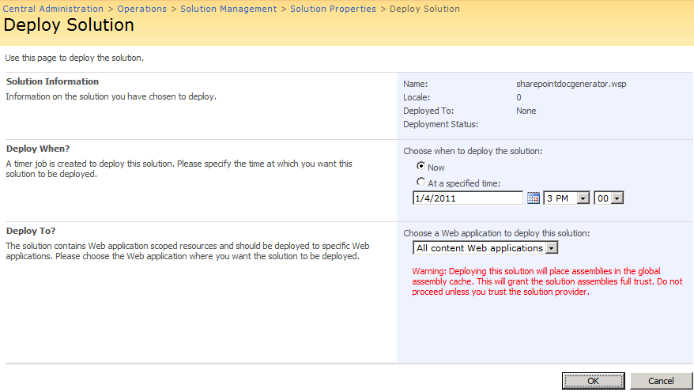
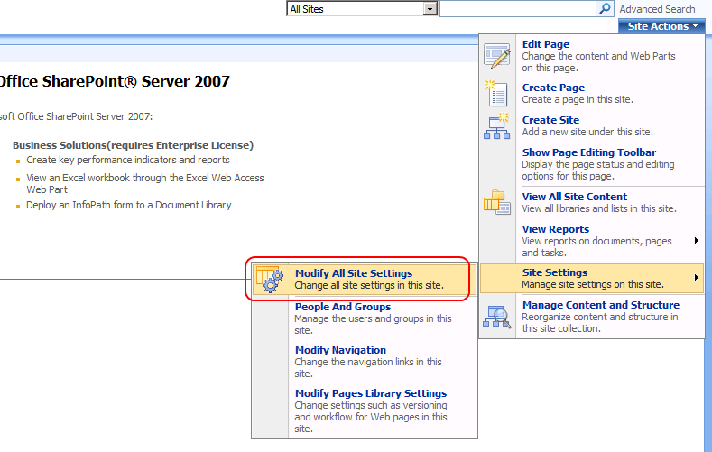
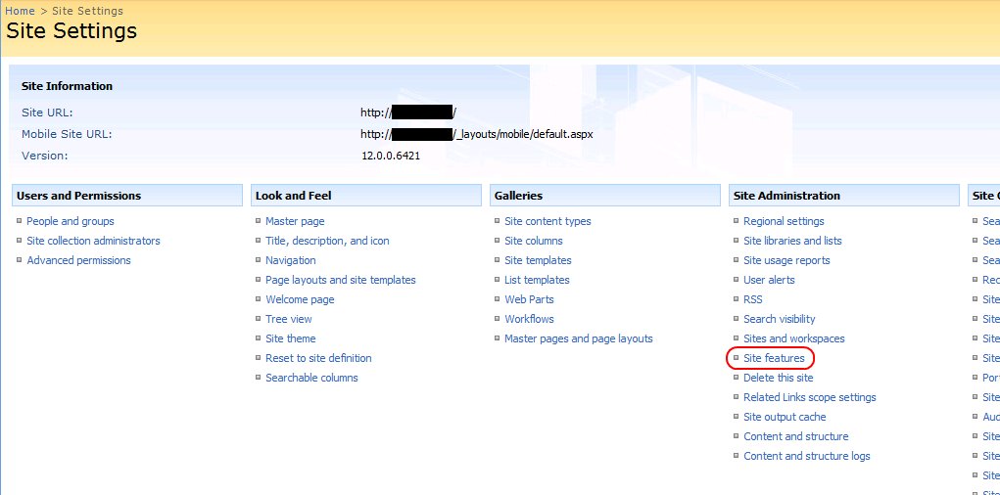
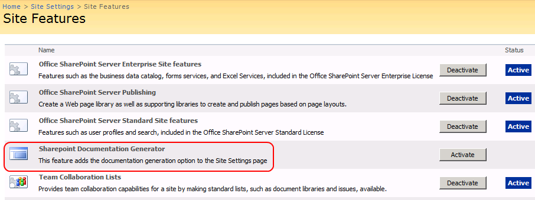
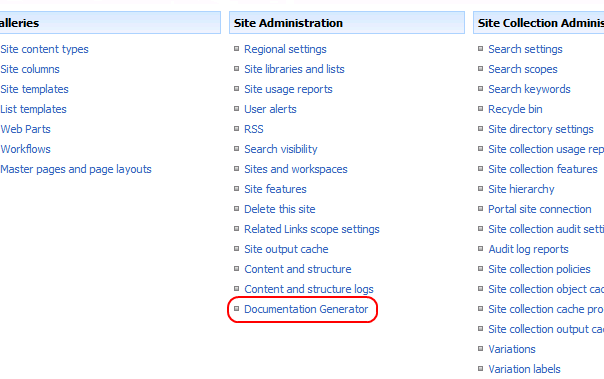
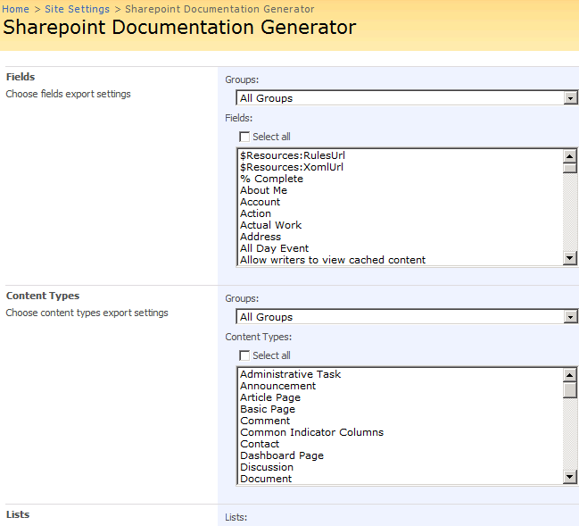

# Installation process
Although these steps might be described in more detail somewhere else, here's a reminder on how to do it:

## 1.- Add the solution using _STSADM_

## 2.- Go to _Central Admin_ | _Solution Management_

## 3.- Select the sharepointdocgenerator package

## 4.- Deploy the solution to the desired web applications

## 5.- Go to any site and select _Modify All Site Settings_

## 6.- Select the site features

## 7.- Activate _Sharepoint Documentation Generator_

## 8.- A new option appears under _Site Settings_

## 9.- Clicking this option shows the interface screen to generate the documentation

