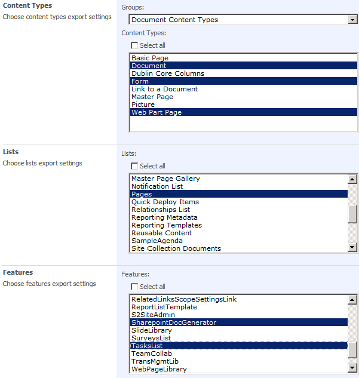
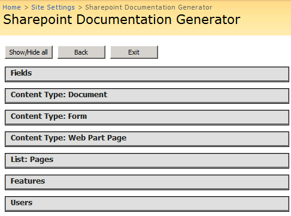
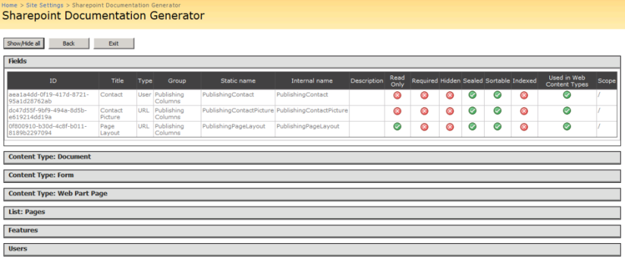
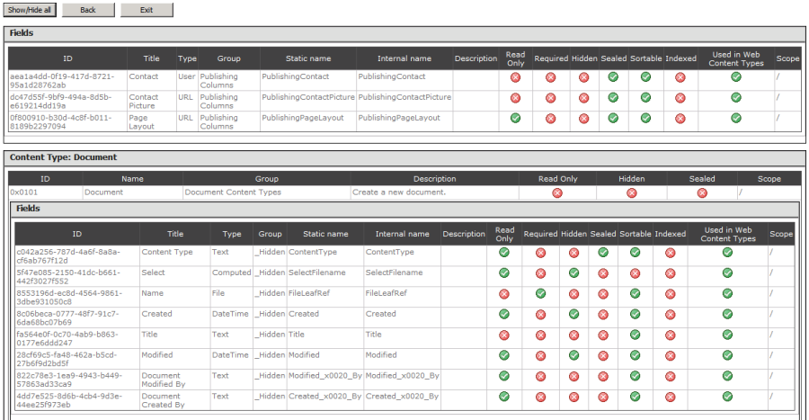
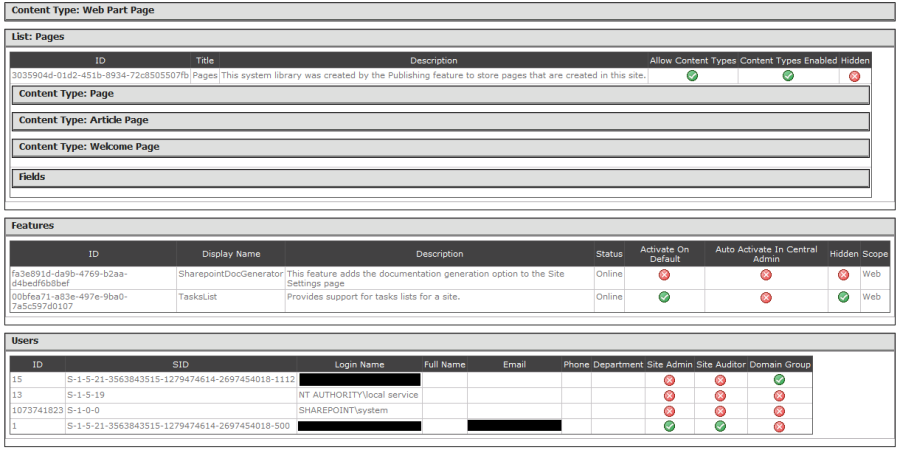

# **CodePlex is shutting down!**

<
As you may already know, after all these amazing years CodePlex is going to stop working, so I've decided to move the binaries over to [my blog](http://blog.gamosoft.com/) to be downloaded from now on. Please use [this direct link to the project](http://blog.gamosoft.com/sharepoint-documentation-generator/) to update your bookmarks.
I'll probably put the code elsewhere but for the moment my blog is where you can keep updated of what's going on with the project (or ask questions, etc...). The project will still remain in Codeplex until the site is closed but will no longer be updated.

Thanks for these years CodePlex!!!

**Project Description**
New MOSS 2007/2010 feature to automatically generate documentation/tables for fields, content types, lists, users, etc...

**Introduction**
Ever wanted to document some components of an existing MOSS site? This tool allows you to get a listing of fields, content types, lists, features and users of a specified site.
It installs as a new feature that creates a new option under _Site Settings_ | _Site Administration_ menu called **Documentation Generator**.
The whole project was born due to a need of looking at some content types in a structured fashion, so I could see at a glance columns, types, etc...

Currently displays information in the same web page, using templates for the different elements to be documented. These templates can be modified here:

_%12HIVE%\TEMPLATE\LAYOUTS\SharepointDocGenerator\Templates_

If you just want to change the look and feel, please use the same variables/names inside the templates, just modify styles, colors, etc to display them in a different way.
When you want to add/extend some properties you'll want to take a look at the code behind for the templates to see how this information is extracted.

This package uses jQuery and jQueryUI to display/collapse sections in the HTML page but you can change whatever styles to suit your needs and modify in the templates.
Only users with administrator privileges will be able to use this option (site administrators).

If you want to make changes to the code and regenerate the WSP package, you can use WSPBuilder [http://wspbuilder.codeplex.com/](http://wspbuilder.codeplex.com/).

Right now the release download works only for MOSS 2007 due to DLL references, but I'm planning on recompiling it for SP2010 with the updated ones. In the meantime, if you want to use it for SP2010 you can grab the code and build the package yourself. :-)

**Update**
I have uploaded a new package for SP2010 [http://sharepointdocgen.codeplex.com/releases/view/58926](http://sharepointdocgen.codeplex.com/releases/view/58926) which has the same code, and fixed the incorrect version of the assemblies being referenced.

**Installation**
Installation is pretty simple using WSP deployment standards. Please check the following link for more information: [http://sharepointdocgen.codeplex.com/documentation](http://sharepointdocgen.codeplex.com/documentation)

**Usage**
Just choose the desired fields, content types, etc... from the main screen and hit the _OK_ button.

A new screen shows the titles of each section.

You can show/hide all sections clicking the appropriate button, or section by section in the desired headers.

There can be sections nested within sections, like fields inside content types

Or content types and fields inside lists, for instance

This project can be extended to make it more flexible, add printout capabilities, etc... but I wanted to upload it right now so other people can use it if needed. :-)

Enjoy!

**Other projects**
Here are other projects you might be interested in as well:

* [http://outlook2013addin.codeplex.com](http://outlook2013addin.codeplex.com)
* [http://entlibextensions.codeplex.com](http://entlibextensions.codeplex.com)
* [http://endomondoexport.codeplex.com](http://endomondoexport.codeplex.com)
* [http://fiddlertreeviewpanel.codeplex.com](http://fiddlertreeviewpanel.codeplex.com)
* [http://slbindabledatagrid.codeplex.com](http://slbindabledatagrid.codeplex.com)